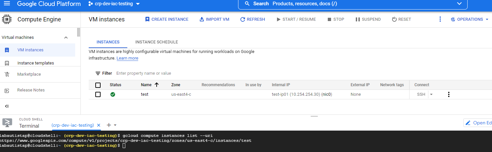

# COMANDOS DE GCLOUD

* ## Listar Compute Engine
<br>

To list all instances in a project in table form, run:
```
gcloud compute instances list
```


To list the URIs of all instances in a project, run:
```
gcloud compute instances list --uri
```


* ## Listar IP's en uso, existentes o reservadas
<<<<<<< HEAD
To list all IP's in use, existing or reserved, run:
```
gcloud compute addresses list
```
=======
<br>

Lista de direcciones de cálculo de gcloud - lista de direcciones.
```
gcloud compute addresses list   
```
Enumera la información resumida de las direcciones en un proyecto. La --uri opción se puede utilizar para mostrar URI en su lugar. Los usuarios que deseen ver más datos deben utilizar gcloud compute addresses describe.
De forma predeterminada, se enumeran las direcciones globales y las direcciones de todas las regiones. Los resultados se pueden acotar proporcionando el indicador --regions o .--global

**Ejemplo**


>>>>>>> 5d1a29ca315f4e1d37d16edbe5d45ecec5fc1bff

Para enumerar los URI de todas las direcciones en un proyecto, ejecute:
```
gcloud compute addresses list --uri
```

Para enumerar todas las direcciones globales en un proyecto, ejecute:
```
gcloud compute addresses list --global
```

Para enumerar todas las direcciones de la us-central1región, ejecute:
```
gcloud compute addresses list --filter=region:us-central1
```

* ## Listar VPCs que están siendo compartidas desde el proyecto origen
<br>

Listar VPCs que están siendo compartidas desde el proyecto origen, ejecute:
```
gcloud compute shared-vpc associated-projects list host-project
```
**Ejemplo**


* ## Listar Buckets disponibles
<br>

Para enumerar los bucket's de un proyecto, ejecute:
```
gsutil ls   
```
**Ejemplo**


* ## Listar Service Accounts existentes en un proyecto

Ejecuta el comando `gcloud iam service-accounts list` para enumerar todas las cuentas de servicio de un proyecto.

Comando:

        gcloud iam service-accounts list 


El resultado es la lista de todas las cuentas de servicio en el proyecto:

| NAME | EMAIL |
| --- | --- |
| *SA_DISPLAY_NAME_1* | *SA_NAME_1*@*PROJECT_ID*.iam.gserviceaccount.com |
| *SA_DISPLAY_NAME_2* | *SA_NAME_2*@*PROJECT_ID*.iam.gserviceaccount.com |

**Ejemplo**

<p align="center">

</p>


* ### **REFERENCIAS**

- Compute Engine [Como listar compute Engine](https://cloud.google.com/sdk/gcloud/reference/compute/instances/list).
- Service Accounts [Como listar cuentas de servicio](https://cloud.google.com/iam/docs/creating-managing-service-accounts?hl=es-419#listing).
- Direcciones IP  [Como listar direcciones IP's](https://cloud.google.com/sdk/gcloud/reference/compute/addresses/list).


