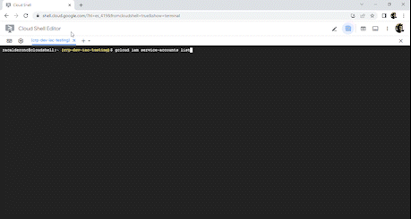

<h1 align="center">☁☁COMANDOS GCP CLI☁☁</h1></font>


<p>
Antes de saber exactamente qué es Google Cloud Platform, es importante comprender el concepto de computación en la nube.

En pocas palabras, podemos definir la computación en la nube como la posibilidad de almacenar datos de forma remota, es decir, en la nube.
</p>


<p>
Esta evolución tecnológica permite que diferentes sectores compartan información sin necesidad de software o sistema de almacenamiento de datos.

La comunicación también se beneficia de la informática. Con esta tecnología, la empresa también es capaz de facilitar la comunicación vertical y horizontal, reduciendo errores en la interpretación de datos y agilizando la toma de decisiones. Además, por supuesto, de generar más independencia para los empleados que trabajan de forma remota.
</p>

<div align="center">

**[UBICAR PROYECTO](https://github.com/racalderonc/BuenaMaravillaEscuadronLobo-tareas#Ubicarse-en-el-Proyecto-) • 
[Abrir CLI](https://github.com/racalderonc/BuenaMaravillaEscuadronLobo-tareas#Abrir-Google-Cloud-CLI-) • 
[Listar Componentes Compute Engine](https://github.com/racalderonc/BuenaMaravillaEscuadronLobo-tareas#Listar-Compute-Engine) • 
[IPS Reservadas y Existentes](https://github.com/racalderonc/BuenaMaravillaEscuadronLobo-tareas/tree/main/Tarea3#listar-ips-en-uso-existentes-o-reservadas) • 
[VPC's Compartidas](https://github.com/racalderonc/BuenaMaravillaEscuadronLobo-tareas/tree/main/Tarea3#listar-vpcs-que-est%C3%A1n-siendo-compartidas-desde-el-proyecto-origen) • 
[Listar Buckets](https://github.com/racalderonc/BuenaMaravillaEscuadronLobo-tareas/tree/main/Tarea3#listar-buckets-disponibles) • 
[Listar Cuentas de Servicio](https://github.com/racalderonc/BuenaMaravillaEscuadronLobo-tareas/tree/main/Tarea3#listar-service-accounts-existentes-en-un-proyecto)**

</div>

* ## Abrir Google Cloud CLI
En primer lugar sera importante saber como abrir la terminal de google cloud para poder trabajar con los difentes comandos que mostraremos a continuación.

<p align="center">
  
</p>


* ## Ubicarse en el Proyecto

Para ubicarnos en el proyecto en cual deseamos trabajar es necesario utilizar el siguiente comando para indicar que se debe trabajar en el proyecto en especifico.

```
gcloud config set project myProject
```

<p align="center">
  
</p>


* ## Listar Compute Engine
<br>

To list all instances in a project in table form, run:
```
gcloud compute instances list
```
<p align="center">

</p>

<p align="center">
  
</p>


To list the URIs of all instances in a project, run:
```
gcloud compute instances list --uri
```
<p align="center">

</p>
<p align="center">
  
</p>

* ## Listar IP's en uso, existentes o reservadas

<br>

Lista de direcciones de cálculo de gcloud - lista de direcciones.
```
gcloud compute addresses list   
```
Enumera la información resumida de las direcciones en un proyecto. La --uri opción se puede utilizar para mostrar URI en su lugar. Los usuarios que deseen ver más datos deben utilizar gcloud compute addresses describe.
De forma predeterminada, se enumeran las direcciones globales y las direcciones de todas las regiones. Los resultados se pueden acotar proporcionando el indicador --regions o .--global

**Ejemplo**

Para enumerar los URI de todas las direcciones en un proyecto, ejecute:
```
gcloud compute addresses list --uri
```

Para enumerar todas las direcciones globales en un proyecto, ejecute:
```
gcloud compute addresses list --global
```

Para enumerar todas las direcciones de la us-central1región, ejecute:
```
gcloud compute addresses list --filter=region:us-central1
```
<p align="center">

</p>

<p align="center">

</p>


* ## Listar VPCs que están siendo compartidas desde el proyecto origen
<br>

Listar VPCs que están siendo compartidas desde el proyecto origen, ejecute:
```
gcloud compute shared-vpc associated-projects list host-project
```
**Ejemplo**
<p align="center">

</p>

<p align="center">
  
</p>

* ## Listar Buckets disponibles
<br>

Para enumerar los bucket's de un proyecto, ejecute:
```
gsutil ls   
```
**Ejemplo**
<p align="center">

</p>

<p align="center">
  
</p>

* ## Listar Service Accounts existentes en un proyecto

Ejecuta el comando `gcloud iam service-accounts list` para enumerar todas las cuentas de servicio de un proyecto.

Comando:

        gcloud iam service-accounts list 


El resultado es la lista de todas las cuentas de servicio en el proyecto:

| NAME | EMAIL |
| --- | --- |
| *SA_DISPLAY_NAME_1* | *SA_NAME_1*@*PROJECT_ID*.iam.gserviceaccount.com |
| *SA_DISPLAY_NAME_2* | *SA_NAME_2*@*PROJECT_ID*.iam.gserviceaccount.com |


<p></p>
<p></p>


<p align="center">
  
</p>


* ### **REFERENCIAS**
- Colocarse en el proyecto a trabajar [Configurar el Proyecto a trabajar](https://cloud.google.com/sdk/gcloud/reference/config/set)
- Compute Engine [Como listar compute Engine](https://cloud.google.com/sdk/gcloud/reference/compute/instances/list).
- Service Accounts [Como listar cuentas de servicio](https://cloud.google.com/iam/docs/creating-managing-service-accounts?hl=es-419#listing).
- Direcciones IP  [Como listar direcciones IP's](https://cloud.google.com/sdk/gcloud/reference/compute/addresses/list).
- VPCs Compartidas [Como listar VPCs compartidas](https://cloud.google.com/sdk/gcloud/reference/compute/shared-vpc/associated-projects/list).
- Listar Buckets Opción 1 [Como listar los Buckets](https://cloud.google.com/storage/docs/listing-buckets#cli-list-buckets)
- Listar Buckets Opción 2 [Como listar los Buckets](https://cloud.google.com/storage/docs/gsutil/commands/ls)


